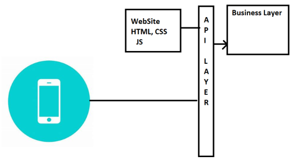
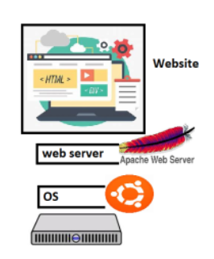
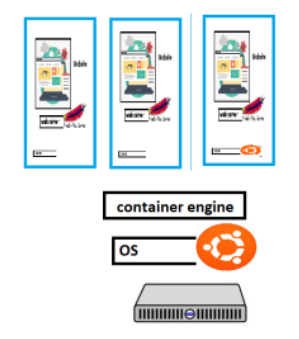

### Story of an organization and Problem introduction

* Organization name: Contoso
* Application: ecommerce
* Architecture:


* _**Problems**_:
    * Different front-ends (ios, Andriod)
        * Accesibility
        * Cross platform

    

    * Deployment of new features:
        * typically are having more downtimes
        * Zero Down time Deployments
        * Faster Deployments
    * Contoso wants to run this application on any cloud or on-premises.
        * Portability
    * De Composing application into smaller services according the business needs

    

    * Updating any microservice can be done independently
    * Re using microservices is much easier.
    * Scaling for microservice is much easier and cheaper compared to Scaling monolith.
* _**Solution**_:
    * Container technology (Docker)
    * Container Orchestration (Kubernetes)

### Application Deployments

* _**Terms**_

    * Capex: Captial * Expenditure
    Opex: Operational Expenditure
    * Physical Server
    * Hypervisor
    * Virtual Machine
    * Return on Investment (ROI) 

#### Evolution

* _**Generation 1**_: Directly run on Physical Servers
    * Directly run on physical servers
    * If your application is not utilizing hardware completely, ROI is very long
    
    

* _**Generation 2**_: Hypervisors create virtual machines and applications installed in virtual machines
* Hypervisors perform hardware virtualizationa and provide
    * virtual cpu
    * virtual ram
    * virtual disk
    * virtual network
* In the isolated area created by hypervisor, we can install os and necessary softwares
* Application can be installed and used from here
* Better ROI

* _**Generation 3**_: _**Containers**_: These are isolated areas which look like vms but the container is an isolated area which has virtualized os.
* Applications running in Containers will not feel the difference
* We can run more applications on a single box


### What is Docker?

* _**Docker (dock worker)**_ is used to create containers which is standard way of packaging any application
* Application can be any of the below but have a standard way of packaging i.e docker image.
    * developed in any technology
    * developed on any server
* Packaging in docker image format helps us to run our application



#### Expectations from you in terms of Docker

* Containerize any application run by your organization.
* Manage Data, Security and Networks for containerized applications.
* To acheive the above expectations, we need to use
    * docker and understand how it runs and creates containers
    * play with docker aroud networks, data and security
    * apply them to our application

### Run apache server (VM)

* Create a vm (ubuntu) and ssh into it
```
sudo apt update
sudo apt install apache2 -y
```
* Now navigate to `http://<public-ip>`

7th picture

* Now let's try to also install nginx
```
sudo apt update
sudo apt install nginx -y
```
### Docker Installation

* When we install docker we get two major components
    * _**Docker client**_:
        * A command line to interact with docker engine

    

    * _**Docker engine**_: This is collection of multiple components
        * Orchestration
        * Docker daemon
        * Runtime
* to play with docker commands
    * manual --help
    * cheatsheet
* Install
    * _**Linux VM**_:
        * Docker can be installed by following instructions over here 
        
        [ Refer Here : https://docs.docker.com/engine/install/ ]

        * script based installation 
        
        [ Refer Here : https://get.docker.com/ ]
       ```
       curl -fsSL https://get.docker.com -o get-docker.sh
       sh get-docker.sh
       ```
       9th picture
       * Docker allows communication to the unix socket for the users who belong to docker group. so lets add current user to docker group `sudo usermod -aG docker <username>`. logout and login
* Now execute `docker container run hello-world`

10 th picture

#### Windows 10/11 (Non Home editions)

* [ Refer Here : https://docs.docker.com/desktop/install/windows-install/ ]
* I will not recommend installing docker on windows

#### Docker Playground

* Create a Docker Hub account 

    [ Refer Here : https://hub.docker.com/ ]

* This playground gives a linux machine with docker installed for 4 hours for free

    [ Refer Here : https://labs.play-with-docker.com/ ]

#### Terms To be aware of

* containerd
* runc
* libcontainer
* oci
* docker shim
* appc
* grpc
* rkt containers

        
