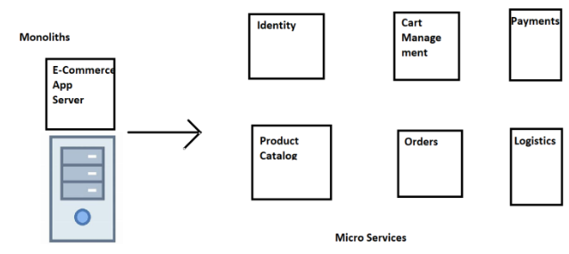
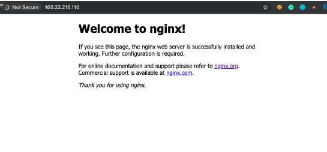
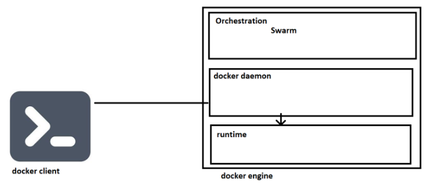
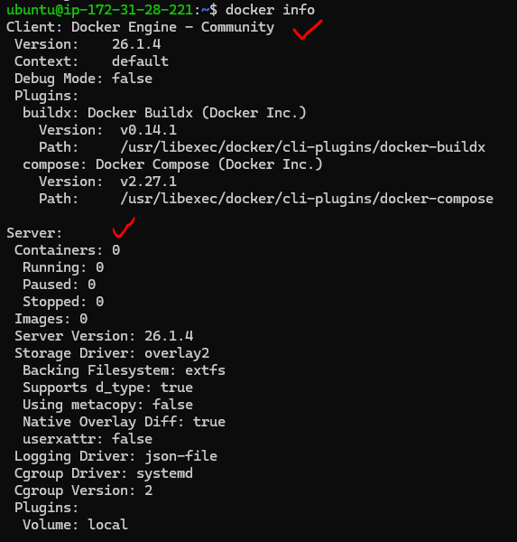
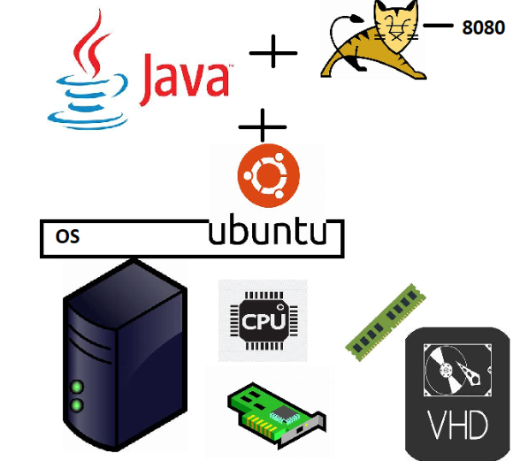

### Story of an organization and Problem introduction

* _**Organization name**_ : Contoso
* _**Application**_ : ecommerce
* _**Architecture**_ :


* _**Problems**_ :
    
 1. Different front-ends ( ios, Andriod )
    + Accesibility
    + Cross platform

  

 2. Deployment of new features : typically are having more downtimes
    + Zero down time deployments
    + Faster deployments
 3. Contoso wants to run this application on any cloud or on-premises
    + Portability
 4. De Composing application into smaller services according to the business needs

 

 5. Updating any microservice can be done independently
 6. Re using microservices is much easier
    + Scaling for microservice is much easier and cheaper compared to Scaling monolith

* _**Solution**_ :

 1. Container Technology ( _**Docker**_ )
 2. Container Orchestration ( _**Kubernetes**_ )

#### Application Deployments - Terms

 1. _**Capex (Capital Expenditure)**_ : Investment made by organisation for purchasing of servers 
 2. _**Opex (Operational Expenditure)**_ : Investment made by organisation to maintain servers
 3. _**Physical Server**_ : Racks have servers where we can directly install an application
 4. _**Hypervisor**_ : Software used to create virtual machines. They are of two types : `ONE`, which can be installed directly on servers and create virtual machines. `TWO`, where we install over the OS and then create virtual machines.
 5. _**Virtual Machine**_ : Isolated space to virtually create hardware and run applications individually
 6. _**Return on Investment (ROI)**_ : How much returns or results achieved in order to create hardware and running applications efficiently

### Evolution

1. _**Generation 1**_ : 

    * Directly run on physical servers
    * If your application is not utilizing hardware completely, ROI is very long
    
    

2. _**Generation 2**_ : 
    
    * Hypervisors create virtual machines and applications installed in virtual machines
    * Hypervisors perform hardware virtualization and provide
      + virtual cpu
      + virtual ram
      + virtual disk
      + virtual network
    * In the isolated area created by hypervisor, we can install OS and necessary softwares
    * Application can be installed and used from here and also have better ROI

    

3. _**Generation 3**_ - _**Containers**_ : 

    * These are isolated areas which look like vms but the container is an isolated area which has virtualized OS
    * Applications running in Containers will not feel the difference
    * We can run more applications on a single box

    

### What is Docker ?

* _**Docker (Dock worker)**_ is used to create containers which is standard way of packaging any application
* Application can be any of the below but have a standard way of packaging i.e _**Docker image**_.
    + developed in any technology
    + developed on any server
* Packaging in docker image format helps us to run our application everywhere possible


#### Expectations in terms of docker from you

* Containerize any application run by your organization
* Manage Data, Security and Networks for containerized applications
* To acheive the above, we need to use :
    + Docker and understand how it runs and creates containers
    + play with docker aroud networks, data and security
    + apply them to our application

#### Run apache server and nginx (VM)

* Create a VM (Ubuntu) and ssh into it
```
sudo apt update
sudo apt install apache2 -y
```
* Now navigate to `http://<public-ipaddress>`


* Now let's try to also install nginx and navigate to `http://<public-ipaddress>`
```
sudo apt update
sudo apt install nginx -y
```


### Docker Installation

* When we install docker we get two major components :

 1.  _**Docker client**_ : A command line to interact with docker engine



 2. _**Docker engine**_ : This is collection of multiple components
        * Orchestration
        * Docker daemon
        * Runtime
* to play with docker commands
    * manual --help
    * cheatsheet

#### Installations

 1. _**Linux VM**_:

    * Create a VM with standard configuration
    ```
    sudo cat /etc/group
    sudo cat /etc/passwd
    ```
* Docker can be installed in many ways :  

 +  Using following instructions
        
    [ Refer Here : https://docs.docker.com/engine/install/ ]

 + Script based installation 
        
    [ Refer Here : https://get.docker.com/ ]

```
curl -fsSL https://get.docker.com -o get-docker.sh
sh get-docker.sh
docker info
```


* Docker allows communication to the unix socket for the users who belong to docker group `sudo cat /etc/group`
* So let's add current user `ubuntu (whoami)` to docker group `sudo usermod -aG <groupname> <username>` _**sudo usermod -aG docker ubuntu**_
* Then exit and relogin `docker info`



* Now execute `docker container run hello-world`


2. _**Windows 10/11 (Non Home editions)**_


    [ Refer Here : https://docs.docker.com/desktop/install/windows-install/ ]

* _**Note**_ : Installing docker on windows is not recommended

3. _**Mac**_

    [ Refer here : https://docs.docker.com/desktop/install/mac-install/ ]

#### Docker Playground

* Create a Docker Hub account 

    [ Refer Here : https://hub.docker.com/ ]

* This playground gives a linux machine with docker installed ( 4 hours for free ) 

    [ Refer Here : https://labs.play-with-docker.com/ ]

#### Terms to be aware of

* containerd
* runc
* libcontainer
* oci
* docker shim
* appc
* grpc
* rkt containers

 * Applications bring revenue to enterprises and to run applications we need servers, OS, etc

#### Let's create a linux server and install tomcat in it
* Create a linux server ( AWS / Azure / GCP ) 



* We have experimented in the _**Linux VM ( Ubuntu )**_
    * network interface gives network connectivity
    * cpu, ram and disk are available
    * to install softwares we have used package manager `apt`
* Commands
```
htop
sudo apt update
sudo apt install net-tools -y
if config
sudo apt install openjdk-11-jdk -y
java -version
sudo apt install tomcat9 -y
sudo systemctl status tomcat9
```
* _**NOTE**_ :

+ to check network => `ifconfig`
+ to check java => `java -version`
+ to check tomcat => `sudo systemctl status tomcat9`

* We were able to exactly perform similar operations inside the container as well

#### Let me take a application

* This is spring pet clinic application
* Let's try to run this application on linux ( ubuntu )

    [ Refer Here : https://github.com/spring-projects/spring-petclinic ]

* To build the code
```
sudo apt update
sudo apt install openjdk-17-jdk maven -y
git clone https://github.com/spring-projects/spring-petclinic.git
cd spring-petclinic/
# java package
mvn package
java -jar target/spring-petclinic-3.0.0-SNAPSHOT.jar
```


* Docker way of working
  * We create a _**Docker image (docker packaging format)**_
    * We need to create _**Dockerfile**_
    * Push the image to _**registry (docker hub, public registry)**_
    * Create the _**container**_ using the image anywhere

* Install docker on the VM using script and add to docker group
```
curl -fsSL https://get.docker.com -o get-docker.sh
sh get-docker.sh
sudo usermod -aG docker ubuntu
exit
relogin
cd spring-petclinic/
```
* _**Dockerfile**_ for spring pet clinic
```
FROM amazoncorretto:17-alpine-jdk
LABEL author=Harikag
ADD target/spring-petclinic-3.0.0-SNAPSHOT.jar /springpetclinic.jar
EXPOSE 8080
CMD ["java", "-jar", "/springpetclinic.jar"]
```
* Add the Dockerfile and create docker image
```
vi Dockerfile
docker image build -t spc:1.0 .
```
* to create container at the original port `-P`
```
docker container run -d -P spc:1.0
```
* to create container at the different ports `-p` ( remember to allow open the required ports )
```
docker container run -d -p 8081:8080 spc:1.0
docker container run -d -p 8082:8080 spc:1.0
docker container run -d -p 8083:8080 spc:1.0
```
* expose over the browser with the desired port

#### How Isolations are created ? ( OR ) How Containers Work ?

* Each container is getting a
    * new process tree
    * disk mounts
    * network (nic)
    * cpu/memory
    * users
* Docker Internals

    [ Refre here : https://directdevops.blog/2019/01/31/docker-internals/ ]

    

### Docker Architecture

_**Generation 1:**_

* This was first gen, Where docker daemon used lxc (a linux kernel feature) to create containers


_**Generation2:**_

* Since docker was relying on lxc which was kernel feature, updates to kernel frequently used to break containers created by docker
* So docker has created its own component called libcontainer (libc) to create containers
* Docker wanted containers to be multi os and lxc was definetly not the way forward


* Adoption of docker was drastically increased as it was stable

_**Generation 3:**_

* In this generation, docker engine was revamped from monolith to multi component architecture and the images and containers were according to OCI (open container initiative) image spec and runtime spec.
* In the latest architecture
* docker daemon exposes api’s to listen requests from docker client.
* Passes the requests to containerd. This manages the lifecylcle of container
* containerd forks a runc process which creates container. once the container is created the parent of the container will be docker shim


#### Creating our first docker container

 _**docker container creation:**_

* To create container we need some image in this case lets take `hello-world`
* The command `docker container run hello-world` executed
* What happens
    * docker client will forward the request to docker daemon
    * docker daemon will check if the image exists locally. if yes creates the container by using image
    * if the image doesnot exist, then docker daemon tries to download the image from docker registry connected. The default docker registry is docker hub.
    * Downloading image into local repo from registy is called as pull.
    * Once the image is pulled the container is created.


* Registry is collection of docker images hosted for reuse.
* Docker hub 

    [ Refer Here : https://hub.docker.com/search?q= ]

#### Playing with containers

* Create a new linux vm and install docker in it


* Open all ports
    * AWS

 


#### Check docker images in the host


#### Pull the images from docker hub

* image naming convention
```
[username]/[repository]:[<tag>]
shaikkhajaibrahim/myspc:1.0.1
username => shaikkhajaibrahi
repository => what image => myspc
tag => version => 1.0.1
```

* default tag is latest 
```
nginx
nginx:latest
```

* Official images don't have username
```
nginx
ubuntu
alpine
shaikkhajaibrahim/myspc
```

* Lets pull the image nginx with tag 1.23
```
docker image pull nginx:1.23
docker image ls
```


* Let's pull the jenkins image with latest version


* Let's find the alpine and pull the image


#### Remove images from local

* Every image will have unique image id and image name
* We can delete individually `docker image rm alpine:3.17`
* if I have to delete all the images `docker image rm $(docker image ls -q)`


#### Create a container with nginx

* To create and start the container we use run command


* _**note:**_ i will be using -d for some time and we will discuss importance of this in next session
* every container gets an id and a name. name can be passed while creating container, if not docker will give random name


* Remove all the running containers `docker container rm -f $(docker container ls -q )`


* Remove specific container


* Remove all containers `docker container rm -f $(docker container ls -a -q )`


* _**Exercise:**_ Start and stop containers


